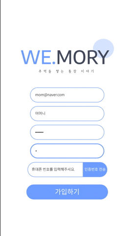

# 🏡 WEMORY-Frontend

## WEMORY 추억을 기록하는 일기장

- 프로젝트 블루아워 우리은행 온(on)택트 해커톤 장려상 수상

## 💻 DEMO

### 회원가입/메인/일기리스트

  

  

  

### 출금계좌 등록/출금 그래프

  

  

## 🖥 서버 실행법

1. frontend 폴더로 진입한다.
2. `npm i` 를 통해 종속성 다운로드
3. `npm run start`로 서버 구동

## 👩‍👦 Team [Front]

- 16학번 컴퓨터소프트웨어공학과 [최민석](https://github.com/minsgy)

  - React Component 설계
  - React User JWT Auth 설계
  - React Module 설계
  - Redux State

- 19학번 의용메카트로닉스공학과 [하유민](https://github.com/qhahd78)
  - Web/WebApp UI 설계
  - Design UI MoodBoard 설계
  - React Component 설계

## 🔨Tech Stack

- ReactJS
- Redux-devtools-extension
- Redux-thunk
- styled-components (CSS-in-JS)
- Axios
- React Hooks
